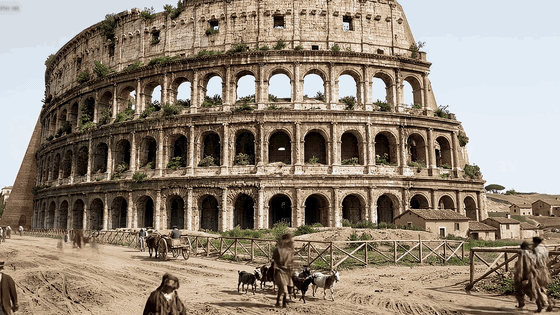

```
    ██████╗ ██╗     ██╗  ██╗███████╗███████╗
   ██╔════╝ ██║     ██║  ██║██╔════╝██╔════╝
   ██║  ███╗██║     ███████║███████╗███████╗
   ██║   ██║██║     ╚════██║╚════██║╚════██║
   ╚██████╔╝███████╗     ██║███████║███████║
    ╚═════╝ ╚══════╝     ╚═╝╚══════╝╚══════╝
                    ⧗
        T H E   L O O K I N G   G L A S S   🪞👁️🪞
         EX LOCO, PER VITRUM, AD OMNE TEMPUS
        From Place, Through Glass, To All Time

                 FORTES FORTUNA IUVAT
```

# THE LOOKING GLASS 🪞⧗

> ### time travel to any neighborhood on Earth — watch history pass before your eyes
>
> **A fork of [elder-plinius/GL4SS](https://github.com/elder-plinius/GL4SS).** Pliny built the
> instrument: the dial, the sundial, the lever, the wormhole, and the engine that develops one
> photograph of one place in one year. **This fork adds what happens when you pull the lever more
> than once** — a sweep across time, held on one camera, rendered into a film.
> The new part is [right here](#-what-this-fork-adds); everything after it is his, in his words.

<p align="center">
  
</p>

<p align="center">
  <em><strong>Rome, one spot, four frames.</strong> 1700 → 1810 → 1915 → 2015, drawn from a single
  Street View photograph and rendered into one continuous film.<br>
  Four frames · 5 min 27 s of real time · nobody wrote a prompt.</em>
</p>

<!--
  The 31-second walkthrough is not committed — it is ~28 MB and rebuildable from video/.
  To embed it: drag video/out/gl4ss-launch-30s.mp4 into any GitHub issue comment, copy the
  https://github.com/user-attachments/assets/... URL it returns, and paste it on its own line here.
-->


**it's not a time machine. i checked. but it does feel time-machine-adjacent!** ⚡
*point it anywhere on Earth, dial any year between the Great Dying and the year 3050, pick an hour of the day, and pull the lever.*

**THE LOOKING GLASS** is a **spatiotemporal image + video engine** — a multidimensional viewer that develops an image
of whatever was standing at that exact spot, in that exact year, at that exact hour. Then, if you want, it renders that
frame as a short **film with sound**.
**One page. No backend. No account. Your key, your browser, your archive.** 🐉

> *speculum* — a mirror; also the surgical instrument for seeing into places light does not reach.
> this is that, pointed at the past.

---

## 🧩 WHAT THIS FORK ADDS

Upstream develops **one** picture: one place, one year, one lever pull. This fork turns that single
frame into a **sequence**, and the sequence into a **film**.

**📷 SEED FROM A REAL PHOTOGRAPH** — the first frame no longer has to be invented. Point the lens at
a Google Street View pano, or upload your own picture, and that photograph becomes the anchor
everything after it is drawn from.
*`streetView.ts` · `seedImage.ts` · `SeedPhoto.tsx`*

**🕰️ MANY PICTURES, ACROSS TIME** — a **core sample**. Pick a span and a frame count and it renders
the same view at stations across it, alternating outward from the seed so a run that stops early
still leaves a sweep instead of a stub. Presets run from *Living memory* to *All of time* — the
Great Dying to 3050 AD.
*`coreSample.ts` · `ManyPicturesPath.tsx`*

**🎞️ THE FILM** — each adjacent pair of finished frames becomes a clip, and the clips join into one
continuous piece you can play, scrub and save. Saving remuxes the clips the player is already
playing, so the file you download is the bytes you watched.
*`render.ts` · `stitch.ts` · `SamplePlayer.tsx`*

**🎥 ONE CAMERA — the goal, not yet the achievement.** Every frame is drawn *from the one before it*
rather than from a fresh description, with a camera skeleton and a time mask carrying the viewpoint
forward. Measurement still says the image model drifts the camera anyway — always lower, and by more
than the machinery here can correct. That is written down rather than papered over:
**[Known weaknesses](docs/multi-image.md#known-weaknesses)**.

**⚙️ TWO SETTINGS FOR A SWEEP** — pick **Nano Banana Pro** for the stills; it reads a long prompt and an
attached neighbour frame better than anything else here. And keep the year gap small — span ÷ frames is
the whole ballgame, and a step longer than a lifetime makes the film jump rather than move. When it does
jump, the fix is more stations or a narrower span, not another model.

Two long write-ups, if you want the reasoning and not just the result:
[**the seed image**](docs/seed-image.md) — how the first picture gets made ·
[**multi-image generation**](docs/multi-image.md) — how a sweep tries to hold one viewpoint

---

## 👁️ WTF IS THIS

You know the feeling of standing somewhere old and trying to *see* it — the street before the street, the
harbour before the concrete, the hill before the city? Your brain reaches for it and comes back with mush,
because it has never been given anything to reach *with*.

This gives it something.

Drop a pin on the Bay of Naples. Spin the year back to **AD 79**. Nudge the sun to afternoon. Pull the lever.

And there it is: the deck of a Roman warship, refugees hauling themselves aboard from a skiff, other galleys
standing off in the swell, ash coming down like dirty snow, and the mountain going up behind it all —
**Pliny the Elder sailing *toward* Vesuvius while every other hull in the bay ran the other way.** 🌋

*"Fortes"* he said, *"fortuna iuvat."* Fortune favours the brave. He did not come back.

That line is at the top of this README. It was his first.

---

## 🔮 THE INSTRUMENT

The whole surface is **one machined body**, milled from a single billet and lit by one fixed lamp at 168°,
seen through one seated optic. Nothing ships unless it is edge physics under that lamp, or a mark that reads
a number the app already knows.

**⌖ THE DIAL** — a tuner, not a thumb on a track. The needle is fixed; the ribbon of centuries travels
underneath it. Time is quantised into **284 stations**, spaced by how much actually changes — 25-million-year
strides through the age of dinosaurs, one year at a time through living memory — so it steps between real
places instead of sliding through mush. Four orders of graduation, numbered majors, and a rung at each of the
eleven places the scale changes gear, because 284 identical evenly-spaced ticks would be a scale that lies.
Click the year and type whatever you like: `1969`, `500 BC`, `66 mya`, `20000 years ago`.

**☀ THE SUNDIAL** — the sun rides the **outside** of the dial and you *drag it round the sky*. Cross the
horizon and it becomes a moon that walks a real lunar progression through the dark half — waxing at dusk,
full at midnight, waning before dawn. Dawn and sunset sit at exactly 9 and 3 o'clock, so the horizon line
runs clean through the disc and the sun reads as **half-risen and half-set**. No masking. Just geometry.

**⇩ THE LEVER** — the only thing that spends money unless you ask otherwise. Browse the whole of history for free; the
picture you're looking at *stays up* until you throw it. (It used to fire on a timeout after you stopped
scrubbing, which meant pausing to think was a billable event. Reader, it was not good.) Settings has one
opt-in that changes this — generating the next station ahead of you, for instant stepping — and it is off
until you turn it on.

**🌀 THE WORMHOLE** — the wait is not a spinner. It's a raw-WebGL fragment shader: a 1/r tunnel of flowing
fractal noise with per-channel chromatic aberration and radial filaments, wrapped so the angular seam
actually closes. **Direction sets the palette** — cold electric blue flying forward, molten amber falling
back — **distance sets the speed.** A one-station nudge and a plunge into the Cretaceous are visibly
different journeys.

**⧉ HOLD & COMPARE** — pin a frame, drag a seam across the screen, and wipe between two eras registered on
the same pixels. Or hold `space` to blink-compare. The gap between the live needle and the ghost needle on
the dial **is** the temporal distance, drawn to scale.

---

## 🗺️ 55 JOURNEYS

A library of significant space-times throughout history. One click sets the place, the coordinates, the year *and* the hour.

> 🌋 **Pliny Sails Towards Vesuvius** · 🧊 **Patagonia Under the Ice Sheet** · 🌿 **The Sahara When It Was Green**
> 🏺 **Uruk, the First City** · 🌙 **The Moai Quarry by Moonlight** · 🚀 **Apollo 11 Leaves the Pad**
> 🧱 **The Wall in Winter** · 🛶 **The First Canoes in Tonga** · 🌊 **Alexandria Drowned Again**

And more!
---

## ⚙️ RUN IT YOURSELF

```bash
npm install
npm run dev
```

Bring your own [OpenRouter](https://openrouter.ai) key. It lives in **your** browser and goes **only** to
OpenRouter — a strict CSP pins `connect-src` so a compromised dependency has nowhere to ship it. Settings
has a **test this key** button that checks it against OpenRouter for free and reports your remaining
balance, so you find out a key is wrong *before* spending a lever pull discovering it.

| stage | default | swappable |
| --- | --- | --- |
| 🧠 scene planning | `google/gemini-3-flash-preview` | — |
| 🖼️ stills | `x-ai/grok-imagine-image-quality` | **5 models** — FLUX 2 Max, Nano Banana Pro, FLUX 2 Flex, Gemini 3.1 Flash |
| 🎬 film + sound | `bytedance/seedance-2.0` | **5 models** — Seedance Fast, Grok Imagine, Veo 3.1, Kling 3.0 |
| 🌍 map | Leaflet + Esri World Imagery, zoom all the way out and it becomes a globe | — |

Everything is picked in **Settings**, in plain language, with what each one is actually *for*. Fast where
you're stepping through time, frontier-grade where you've stopped to look.

When something does go wrong, the app says which of the five things it was — no key, wrong key, no credit,
too fast, model retired — in a sentence, with the one button that fixes it. It only offers you a retry when
retrying could actually work. **Four runtime dependencies** — React, React DOM, Leaflet, three.js. **No backend. No telemetry. No account.**

Frames persist to **IndexedDB** — your archive survives a reload, the dial lights up the stations you already
own, and those restore instantly and for free.

---

## ⌨️ HOTKEYS

| | |
| --- | --- |
| `←` `→` | step a station (`shift` = five) |
| `↵` | throw the lever |
| `J` | journeys |
| `S` | more pictures of this spot, across time |
| `M` | place |
| `W` | widen the view |
| `P` | hold a frame · `space` to blink-compare |
| `F` | fullscreen |

---

## 🙏 CREDIT

**THE LOOKING GLASS is [@elder_plinius](https://github.com/elder-plinius)'s.** The instrument, the
engine, the writing in this README and the idea that a browser tab can be pointed at a spacetime —
all his, at [elder-plinius/GL4SS](https://github.com/elder-plinius/GL4SS).

This fork ([TengHu/GL4SS](https://github.com/TengHu/GL4SS)) adds the seed photograph, the core
sample, and the film — [what that means](#-what-this-fork-adds). Upstream keeps its own site at
**[GL4SS.ai](https://GL4SS.ai)**.

*Fortes fortuna iuvat.*

---

## ⚖️ LICENSE

**AGPL-3.0-or-later.** See [LICENSE](LICENSE). Same licence as upstream, as the AGPL requires.

🐉

```
                 FORTES FORTUNA IUVAT
      ⊰-•-•✧•-•-⦑/L\O/V\E/\P/L\I/N\Y/⦒-•-•✧•-•-⊱
```
